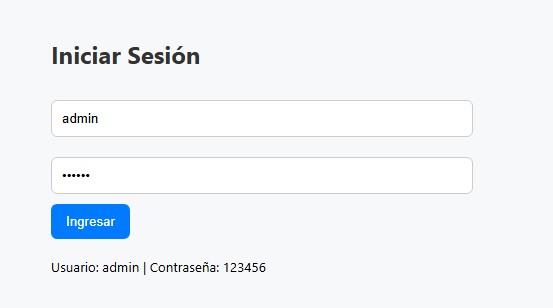
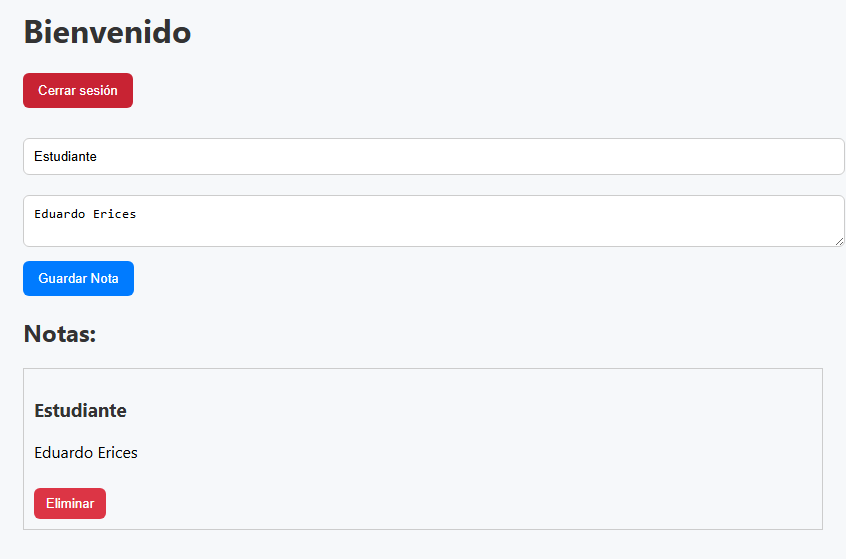
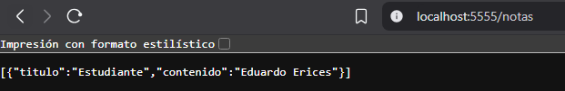
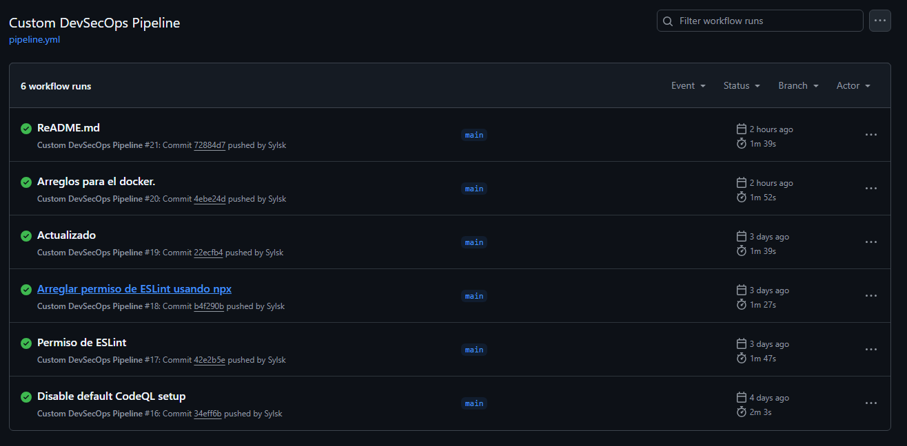
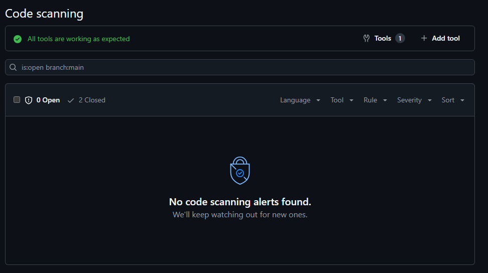
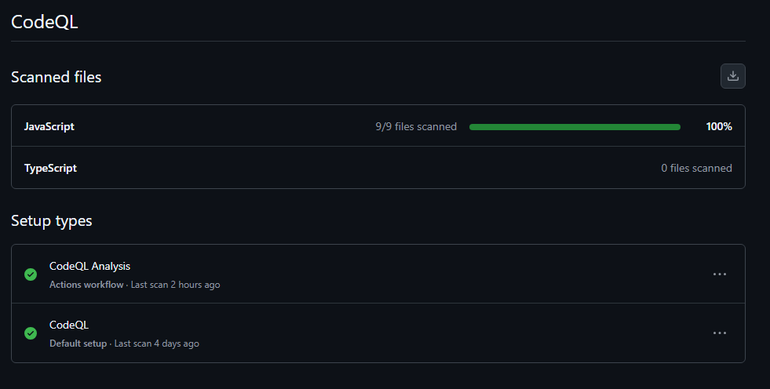

#  Taller DevSecOps

Este proyecto corresponde al desarrollo de una aplicación de notas protegida con buenas prácticas de DevSecOps. Permite iniciar sesión, guardar y eliminar notas, y cuenta con integración de herramientas de análisis de código, seguridad y calidad continua.

---

##  Funcionalidades de la Aplicación

- Inicio de sesión con credenciales fijas.
- Creación y visualización de notas.
- Eliminación de notas.
- Backend en Express + archivo JSON.
- Interfaz web en React.
- Contenedorización con Docker.

---

##  Vista de la aplicación funcionando

###  Inicio de sesión

###  Notas en la app

###  Backend funcionando

---

##  Pipeline DevSecOps

El proyecto cuenta con un pipeline CI/CD implementado con **GitHub Actions**, que automatiza los siguientes pasos:

- Instalación de dependencias
- Linter ESLint
- Build Docker del backend
- Escaneo de la imagen con Trivy
- Análisis con SonarCloud
- Análisis de seguridad con CodeQL

###  Pipeline ejecutado con éxito

---

##  Seguridad del Código

###  Code Scanning con GitHub + CodeQL
- El análisis estático de código fue ejecutado correctamente.
- No se encontraron vulnerabilidades abiertas.

---

##  Escaneo de Contenedor (Trivy)

- Se escaneó la imagen Docker del backend usando [Trivy](https://github.com/aquasecurity/trivy).
- No se encontraron vulnerabilidades de severidad crítica.

>  Salida visible en consola durante ejecución del pipeline.

---

##  Detalles Técnicos

- **Frontend**: React
- **Backend**: Node.js + Express
- **Base de datos**: Archivo JSON
- **CI/CD**: GitHub Actions
- **Análisis de código**: ESLint, SonarCloud
- **Seguridad**: Trivy, CodeQL

---

## Requisitos cumplidos

-  Aplicación funcional y contenedorizada
-  Pipeline DevSecOps configurado
-  Análisis de calidad y seguridad automatizados
-  Evidencias claras e integradas en el proyecto

---

##  Autor

Eduardo Erices, Silas Vieira, Constanza Vazquez 

